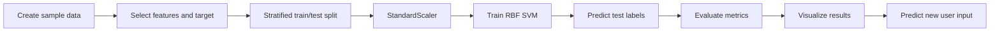

<div align="center">

# ⚡ SVM 30 Practical Samples

### Practical Support Vector Machine classification for monitoring, maintenance, and anomaly detection

[](https://www.python.org/)
[](https://jupyter.org/)
[](https://scikit-learn.org/)
[](https://colab.research.google.com/github/sgsinghashka-del/SVM_30-Practical-Samples/blob/main/SVM_30_Practical_Samples.ipynb)
[](#-academic-and-portfolio-context)

<a href="https://colab.research.google.com/github/sgsinghashka-del/SVM_30-Practical-Samples/blob/main/SVM_30_Practical_Samples.ipynb">
  <strong>▶ Launch the interactive notebook in Google Colab</strong>
</a>

</div>

---

> [!IMPORTANT]
> This repository uses small, constructed datasets for education and demonstration. The example metrics are useful for learning the workflow, but must not be treated as production benchmarks or as evidence for real-world safety, maintenance, or security decisions.

## ✨ Why This Project?

This portfolio-ready notebook shows how a single, reproducible machine learning workflow can be adapted to several practical classification problems. It covers the path from domain-inspired data and feature engineering to model evaluation and interactive prediction.

The examples are intentionally compact, making them suitable for learners who want to understand **what an SVM classifier does, why feature scaling matters, and how to interpret classification results**.

## 📌 Table of Contents

- [Use Cases at a Glance](#-use-cases-at-a-glance)
- [Notebook Preview](#-notebook-preview)
- [Workflow](#-workflow)
- [Technology Stack](#-technology-stack)
- [Quick Start](#-quick-start)
- [Repository Structure](#-repository-structure)
- [What the Notebook Produces](#-what-the-notebook-produces)
- [Academic and Portfolio Context](#-academic-and-portfolio-context)
- [Limitations](#-limitations)
- [Future Improvements](#-future-improvements)
- [License](#-license)

## 🧪 Use Cases at a Glance

| Example | Prediction task | Main input features | Classes |
|:--|:--|:--|:--|
| 🔋 **Battery health** | Estimate battery condition | Charge cycles, voltage, temperature, capacity | Healthy · Weak · Critical |
| ⛽ **Fuel theft detection** | Flag unusual fuel activity | Fuel level, distance, engine status, time | Normal · Suspicious |
| 🛞 **Tyre replacement** | Recommend continued use or replacement | Tread depth, mileage, pressure, age | Continue · Replace |

<details>
<summary><strong>See the learning objective for each example</strong></summary>

- **Battery health:** practice multiclass classification with health categories.
- **Fuel theft detection:** practice binary classification and alert-oriented interpretation.
- **Tyre replacement:** practice maintenance prediction from condition indicators.

</details>

## 🖼️ Notebook Preview

The notebook contains interactive outputs including dataset previews, classification reports, confusion matrices, a fuel-status chart, and user-input prediction panels.

<div align="center">

| Evaluation output | Interactive prediction |
|:--:|:--:|
| Accuracy, precision, recall, and F1-score | Enter domain values and receive a predicted class |
| Confusion matrices for error inspection | Clear formatted result summaries |

[](https://github.com/sgsinghashka-del/SVM_30-Practical-Samples/blob/main/SVM_30_Practical_Samples.ipynb)

</div>

> [!TIP]
> GitHub renders the executed notebook directly in the file view. Open the notebook link above to see the embedded charts and outputs; use the Colab badge to run the cells interactively.

## 🔄 Workflow



Each example follows the same supervised-learning pipeline:

1. Create a domain-inspired sample dataset.
2. Separate predictor variables from the target label.
3. Create stratified training and testing subsets.
4. Fit `StandardScaler` on training data only.
5. Train an `SVC` model with an RBF kernel.
6. Generate predictions for held-out data.
7. Evaluate accuracy and class-level metrics.
8. Inspect errors using a confusion matrix or chart.
9. Transform new inputs and generate a prediction.

## 🧰 Technology Stack

| Tool | Purpose |
|:--|:--|
| **Python 3.9+** | Programming language |
| **pandas** | Dataset construction and tabular data handling |
| **scikit-learn** | Scaling, SVM classification, and evaluation |
| **matplotlib** | Charts and confusion-matrix visualization |
| **Jupyter Notebook / Google Colab** | Interactive experimentation |

## 🚀 Quick Start

### Clone the repository

```bash
git clone https://github.com/sgsinghashka-del/SVM_30-Practical-Samples.git
cd SVM_30-Practical-Samples
```

### Install dependencies

```bash
python -m pip install pandas matplotlib scikit-learn notebook
```

### Run locally

```bash
jupyter notebook SVM_30_Practical_Samples.ipynb
```

Run the cells from top to bottom. The notebook will display metrics, request example inputs, and generate visualizations.

### Run in Google Colab

[](https://colab.research.google.com/github/sgsinghashka-del/SVM_30-Practical-Samples/blob/main/SVM_30_Practical_Samples.ipynb)

No local installation is required when using Colab.

## 📁 Repository Structure

```text
SVM_30-Practical-Samples/
├── SVM_30_Practical_Samples.ipynb  # Interactive SVM examples
└── README.md                       # Project documentation
```

## 📊 What the Notebook Produces

- Dataset previews for each practical example
- Accuracy scores
- Precision, recall, and F1-score reports
- Confusion matrices
- A Normal-versus-Suspicious fuel-status chart
- Formatted predictions from entered feature values

> [!NOTE]
> Because each dataset is small and synthetic, a single train/test split can produce unstable or overly optimistic results. Use cross-validation and independent test data for a serious evaluation.

## 🎓 Academic and Portfolio Context

This project demonstrates foundational skills in:

- Supervised machine learning
- Binary and multiclass classification
- Feature scaling and preprocessing
- Kernel-based SVM modeling
- Classification metrics and error analysis
- Translating real-world questions into predictive features
- Communicating results through visualizations

It can serve as a starting point for a coursework submission, a machine learning portfolio project, or a classroom demonstration of SVM classification.

## ⚠️ Limitations

- The datasets are manually constructed rather than collected from operational systems.
- The examples do not represent validated battery, vehicle, fuel, or tyre behavior.
- Accuracy alone does not measure the cost of false alarms or missed detections.
- Interactive `input()` cells are intended for notebook use and are not a deployed application.

## 🔭 Future Improvements

- Add cross-validation and grid search for `C`, `gamma`, and kernel selection.
- Compare SVM results with linear, tree-based, and ensemble baselines.
- Replace constructed data with validated, documented datasets.
- Add reusable `Pipeline` objects and automated data-quality checks.
- Track class-specific costs and calibration metrics.
- Add tests and a non-interactive command-line prediction interface.
- Save trained models with versioned metadata for reproducible inference.

## 📄 License

This project is provided for educational and demonstration purposes. Add a repository license file if you intend to distribute or reuse the project under a specific open-source license.

## 👤 Author

**Ashka Singh**  
[](https://github.com/sgsinghashka-del)

<div align="center">

⭐ If this project helped you understand SVM classification, consider starring the repository!

</div>
